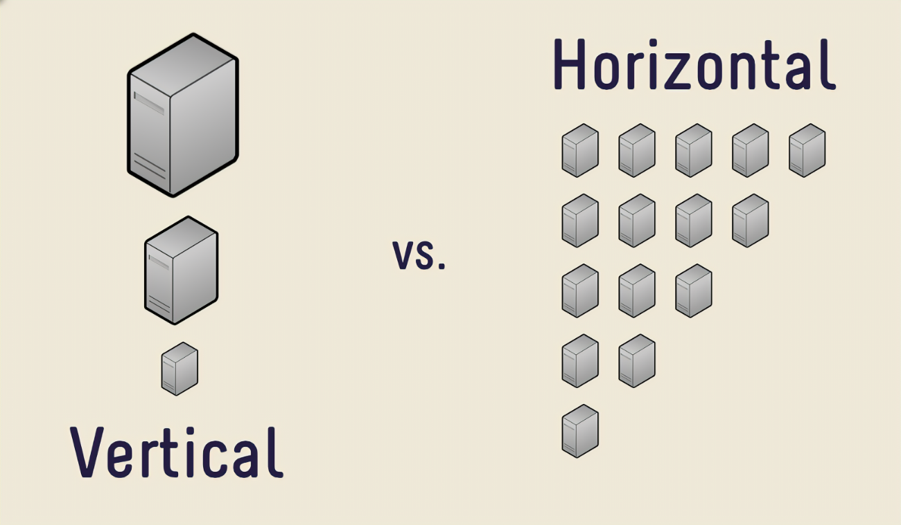

# Arquitetura de Software

## 📚 Sumário

1. [Tipos de Arquitetura](#tipos-de-arquitetura)  
   - [Lei de Conway](#lei-de-conway)  
   - [Papel de um Engenheiro de Software](#papel-de-um-engenheiro-de-software)  
   - [Pilares da Arquitetura de Software](#pilares-da-arquitetura-de-software)  
   - [Requisitos Arquiteturais (RAs)](#requisitos-arquiteturais-ras)

2. [Características Arquiteturais](#características-arquiteturais)  
   - [Características Operacionais](#características-operacionais)  
   - [Características Estruturais](#características-estruturais)  
   - [Características Cross-Cutting](#características-cross-cutting)

3. [Performance](#perfomance)  
   - [Métricas de Performance](#métricas-de-performance)  
   - [Razões para Baixa Performance](#razões-para-baixa-performance)  
   - [Formas de Aumentar a Performance](#formas-de-aumentar-a-performance)  
   - [Caching](#caching)  
   - [Edge Computing](#edge-computing)  
   - [Cloudflare e Vercel](#cloudflare)

4. [Escalabilidade](#escalabilidade)  
   - [Capacidade Computacional](#capacidade-computacional)  
   - [Descentralização](#descentralização)  
   - [Escalando Banco de Dados](#escalando-banco-de-dados)  
   - [Proxy Reverso](#proxy-reverso)

5. [Resiliência](#resiliência)  
   - [Health Check](#health-check)  
   - [Rate Limiting](#rate-limiting)  
   - [Circuit Breaker](#circuit-breaker)  
   - [API Gateway](#api-gateway)  
   - [Service Mesh](#service-mesh)  
   - [Comunicação Assíncrona](#comunicação-assíncrona)

## Tipos de arquitetura

- Software (o mais comum): Relaciona o negócio com os componentes de software. Está diretamente ligada ao processo de desenvolvimento de software
- Solução:Fica entre a área de negócio e software, transformando requisitos de negócio em soluções de software. Arquitetos de solução precisam **saber desenhar soluções**
- Tecnológica: Especialização em uma tecnologia específica, como por exemplo: Arquiteto Elastic, Arquiteto AWS, Arquiteto Oracle
- Corporativa: Políticas e regras que impactam uma organização, como por exemplo: avaliação de possiveis novas tecnologias e planejamento de grandes implantações

### Lei de Conway

Organizações que desenvolvem sistemas de software tendem a produzir sistemas que são cópia das estruturas de comunicação dessas empresas

### Papel de um engenheiro de software

- Transformar requisitos de negócio em padrões arquiteturais
- Melhora a comunicação entre desenvolvedores e clientes
- Entende de forma profunda conceitos de arquitetura
- Auxilia na tomada de decisão
- REFORÇA BOAS PRÁTICAS DE DESENVOLVIMENTO
- Normalmente são atribuídos pra Code Reviewso

### Pilares da arquitetura de software

- Estruturação
    - Ter claro os componentes do sistema
- Componentização
- Relação entre sistemas (sistemas externos ou internos da empresa)
- Governança
    - Existem momentos que precisam existir documentação do sistema
    - Um software precisa evoluir independente da pessoa que está na empresa

### Requisitos Arquiteturais (RAs)

Como alguns requisitos do sistema impactam a arquitetura do software. Alguns requisitos podem ser categorizados por:

- Performance:
    - As requisões não podem passar de 500ms
    - O Backend precisa suportar 1000 requisições por segundo
- Armazenamento de dados:
    - Os dados precisam estar em Data Centers da Europa
- Escalabilidade:
    - O software vai escalar verticalmente ou horizontalmente?
- Segurança:
    - Certificações de E-Commerce
    - A comunicação entre os MS precisa ser criptografado
- Legal:
    - Como crio mecanismos para cumprir a LGPD?
- Audit:
    - As ações do usuário precisam ser logados?
- Marketing:
    - Track de onde vem cada informação
    - Que dispositivo os usuários acessam?

Esses requisitos podem ser reunidos por meio de **documentos** e **planilhas**.

## Características Arquiteturais

### Características Operacionais

Caracteristicas que impactam o quão mais fácil será desenvolver a aplicação

- Disponibilidade
    - *É um dos pontos menos pensados na hora de tomar decisões*
    - Quanto tempo meu software vai ficar disponível?
- Recuparação de desastres
    - O que fazer quando o sistema ficou fora do ar?
- Performance:
    - Latência
    - Quantidade de requisições
- Recuparação
    - Backup
    - É PRECISO TESTAR O BACKUP
- Confiabilidade e segurança
- Robustez
    - O sistema vai conseguir escalar na estrutura de hoje?
- Escalabilidade

### Características Estruturais

- Configurável
    - Muitas aplicações são de difícil configuração. Ex: configuração com o banco de dados
- Extensibilidade
- Fácil instalação
- Reuso de componentes
- Internacionalização
- Fácil manutenção
    - Camadas do sistema
    - SOLID
    - Design Patterns
    - Testes
- Portabilidade
- Fácil suporte
    - Logs
    - Debug

### Características Cross-Cutting

Pontos que cruzam a aplicação geral

- Acessibilidade
    - Principalmente no frontend
- Recuperação de dados
- Autenticação e autorização
- Leis
- Privacidade
    - LGPD
- Segurança
    - **NÃO SER CABEÇA DURA PARA SEGURANÇA, UTILIZE SOLUÇÕES PRONTAS E TESTADAS**
- Usabilidade
    - Front: Experiência do usuário
    - Backend: Usabilidade pra quem vai utilizar meu serviço

## Perfomance

É o desempenho que um software possui para completar um determinado *workload*. É importante destacar que um software performático é diferente de um software escalável.

*Muitas pessoas não sabem medir performance de um sismta*

### Métricas de performance

- **Latência**: Tempo de resposta de uma tarefa, normalmente medida em *milisegundos* (se a latência estiver em segundos, algo está errado). Os principais pontos que impactam a latência são:
    - Rede
    - Chamas externas (APIs de terceiros)
    
Para diminuir a latência de um software é preciso:
    - Aumentando o **Throughput** aceitando uma maior quantidade de requisições

- **Throughput**: Quantas requisições um software consegue aguentar

### Razões para baixa performance

- Processamentos ineficientes
- Recursos computacionais limitados
    - *Tradeoff* custo vs. benefício
- Trabalhar de forma bloqueante (requisições que diminuem o throughput)
- Acesso serial a recursos
    - Pensar em acesso paralelo

### Formas de aumentar a performance

- Aumentar a capacidade computacional (CPU, Disco, Memória, Rede)
- Algoritmos, queries, overhead de frameworks
- Concorrência e paralelismo
- Modelagem correta do banco de dados
- Caching

### Caching

- Dados estáticos (imagens, css, etc.)
- Páginas web (O que o NextJS faz)
- Funções internas
    - Memoização do React
    - Acesso a banco de dados
- Objetos
    - Criar objetos é custoso

### Edge Computing

- Ajuda a trazer informações pro usuário mais próximo a ele, sem que a informação trafegue longas distâncias
- Cache mais próximo ao usuário
- Evita a requisição chegar atéo Cloud Provider
- Guardar arquivos estáticos no cache é muito barato

#### Cloudflare

- Principal plataforma de Edge Computing
- Sua principal ferramenta é o `workers` que gera cache de javascript do navegador do usuário

#### Vercel

- Usado por desenvolvedores frontend para deploy de apps Nextjs

## Escalabilidade

É a capacidade de sistemas suportarem o aumento (ou redução) de workloads incrementando (ou reduzindo) o custo em menor ou igual proporção.

É importante entender a diferença entre Performance e Escalabilidade.

- **Performance:** Foco em reduzir a latência e aumentar o throughput
- **Escalabilidade:** Foco em reduzir ou aumentar o throughput adicionando ou removendo capacidade computacional

### Capacidade computacional

Escalabilidade está relacionado a performance

#### Escalabilidade Vertical

Quando em apenas uma máquina é feito o aumento de recursos computacionais

#### Escalabilidade Horizontal

Quando é aumentado a quantidade de máquinas (Geralmente é integrado um *Load Balancer* pra gerenciar a carga em cada máquina)

Nesse tipo de escalabilidade, o software não depende de nenhuma máquina em específico, ou seja, elas são descartáveis e de fácil substituição.

### Descentralização

Para ajudar na escalablidade horizontal, algumas regras precisam ser seguidas para garantir troca fácil das máquinas.

- **Disco efêmero**: Tudo que foi subido na máquina pode ser perdido. Os dados não são salvos em disco.
- **Servidor de aplicação vs. Servidor de assets**: O servidor de aplicação precisa ser escalável.
- **Cache centralizado**: Fica em um servidor específico de cache.
- **Sessões**: Um usuário não pode ficar logando toda hora em um servidor diferente, as requisições precisam estar centralizadas.
- **Upload e Gravação de arquivos**: Não pode ficar na máquina do usuário, é preciso subir num servidor de arquivos.

### Escalando Banco de Dados

- Aumentar recursos computacionais
- Distribuir responsabilidade: Criar um banco de dados pra escrita e outro pra consulta
- Escalabilidade Horizontal: Aumentar máquinas com banco de dados pra leitura e diminuir a quantidade pra escrita.
- *Serverless*: Quando não se preocupa mais com o lado do servidor, deixar a cloud fazer o trabalho.
- Trabalhar com índice.
- Trabalhar com APM (Application performance monitoring) nas queries
- Explain nas queries
- CQRS (Command Query Responsability Segregation)

### Proxy Reverso

Proxy é um sistema que atua como intermediário entre as requisições do cliente e servidor, redirecionando para o destino apropriado.

Já um Proxy Reverso é um servidor que fica em frente dos servidores web e encaminha solicitações do cliente para esses servidores.

#### Principais soluções de Proxy Reverso

- Nginx
- HAProxy
- Traefik

## Resiliência

Conjunto de estratégias adotadas intencionalmente para adaptação de um sistema quando uma **falha** ocorre. É o poder de se adaptar a algo inesperado quando algo der errado.

> É preciso entender: UM SOFTWARE SEMPRE VAI FALHAR

### Health Check

Feramenta para verificar a saúde do sistema. Um sistema que não está saudável possui uma chance de se recuperar caso o tráfegeo pare de ser direcionado a ele temporariamente.

### Rate Limiting

Protege o sistema baseado no que ele foi projetado para suportar.

Pra saber quanto o sistema aguenta é preciso fazer *Teste de estresse e verificar orçamento da empresa*

### Circuit Breaker

Protege um sistema, fazendo com que as requisições feitras pra ele sejam negadas. Por exemplo: retornar status `500`

### API Gateway

Centraliza o recebimento de todas as requisições do sistema, permitindo manipular as requisições e barrar aquelas que não se enquadram nas regras implementadas.

Um API Gateway pode implementar políticas de Rate Limiting, Health Check, etc.

### Service Mesh

- Controla tráfego de rede.
- Toda comunicação de rede é efetuada por meio proxys que ficam em frente de todos os sistemas da rede.
- Evita implementações de proteção pelo próprio sistema.

### Comunicação Assíncrona

- Evita perder dados, por que é possível dar conta de mais requisições.
- Se o servidor estiver fora, os dados não são perdidos.