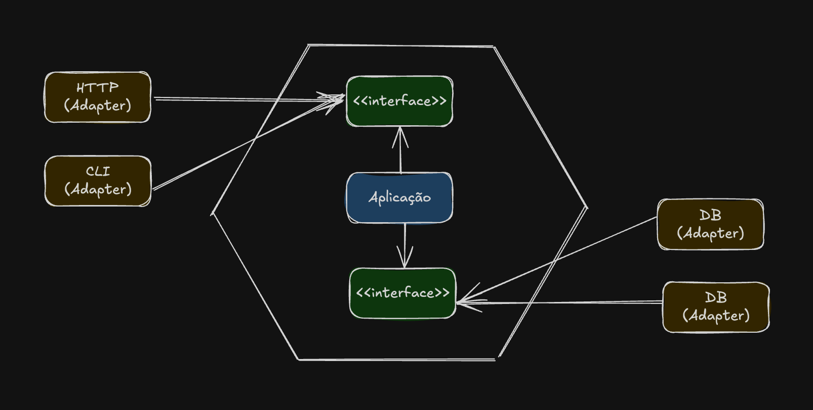

# Arquitetura Hexagonal (Ports and Adapters)

## 📚 Sumário

1. [Ciclo de Vida de Projetos de Software](#ciclo-de-vida-de-projetos-de-software)  

2. [Arquitetura vs. Design](#arquitetura-vs-design)  
   - [Arquitetura de Software](#arquitetura-de-software)  
   - [Design de Software](#design-de-software)

3. [Arquitetura Hexagonal](#arquitetura-hexagonal)  
   - [Lógica básica da Arquitetura Hexagonal](#lógica-básica-da-arquitetura-hexagonal)  
3. [Observações](#observações)

## Ciclo de vida de projetos de software

### Fase 1
- Banco de dados
- Cadastros
- Validações
- Servidor Web
- Views
- Autenticação
- Upload de Arquivos

### Fase 2
- Regras de negócio
- Criação de APIs
- Consumo de APIs
- Autorização
- Relatórios
- Logs

### Fase 3
- Aumento nos acessos
- Upgrade de hardware
- Cache
- API parceiros
- Regras dos parceiros
- Mais relatórios

### Fase 4
- Muito mais acessos
- Mais upgrade de hardware
- Relatórios no Bando de Dados
- Comandos
- Criação da V2 da API

### Fase 5
- Escalar o software horizontalmente
- Problemas de sessões do usuário devido a escalabilidade horizontal
- Problemas com uploads devido a escalabilidade horizontal
- Muita refatoração
- Autoscalling
- CI / CD

### Fase 6
- Mudar a comunicação do sistema (Ex: inserir GraphQL)
- Mudar a apresentação do sistema (Ex: migrar para React)
- Bugs constantes
- Logs
- Integração com sistemas terceiros (Lógica fica misturada)

### Fase 7
- Inconsistência dos dados
- Containerização (Mudar o CI/CD)
- Problemas de memória
- Começando a se livrar do código legado

### Fase 8
- Microserviços (Como fazer com que os MS se comuniquem)
- DB Compartilhado
- Problemas com tracing
- Lentidão
- Custo começa a ficar elevado

### Fase 9
- Muito custo com containers (Mudança para Kubernetes e eventualmente do CI/CD)
- Mensageria
- Perda de mensagens (Pouca experiência com RabbitMQ)

### Fase 10
- Use a imaginação

### Problemas durante o ciclo de vida
- Falta de visão de futuro
    - Sempre haverá refatoração
    - Rotatividade do time
- Limites bem definidos
    - Não misturar lógica da aplicação com regras de negócios e libs
- Troca e adição de componentes
    - Componentes do sistema não são de fácil troca
- Escala
    - Problemas com responsabilidades em diversos servidores
- Otimizações frequentes
    - Muitos débitos técnicos pra trás
- Problemas com mudanças bruscas

## Arquitetura vs. Design

Atividades relacionadas a Arquitetura estão sempre relacionadas a Design, mas nem todas as atividades de Design estão relacionadas a Arquitetura.

### Arquitetura de Software

Tem o objetivo de garantir que os atributos de qualidade, restrições de alto nível e os objetivos de negócio sejam atendidos pelo sistema. 

> Ex: O sistema precisa gerar logs e armazenar em um local central para facilitar a observabilidade

### Design de Software

Está relacionado a detalhes de como um software deve se comportar.

> Ex: Os logs precisam sair por um terminal (stdout) ao invés de um arquivo
> Ex2: S.O.L.I.D é um exemplo clássico de Design de Software

## Arquitetura Hexagonal

Permite que de forma igualitária uma aplicação focada nos usuários, programas, testes automatizados ou scripts seja desenvolvida e testada em isolação de seu ambiente, conexões e banco de dados, ou seja, ela permite isolar a forma como o mundo externo se comunica com o software.

- **Adaptadores** se conectam com objetos externos
- Nada do mundo externo se conecta a aplicação diretamente
- Exemplo de Adapters: 
    - Conexão com DB; 
    - Comunicação HTTP; 
    - Comunicaçãp GraphQL;
    - Outros Apps;
    - Integração de softwares terceiros.

A arquitetura hexagonal expõe um limite muito claro entre o que é a aplicação e as regras de negócio, além de permitir componentização e desacoplamento.

### Lógica básica da Arquitetura Hexagonal

Toda essa segregação e componentização só é possível por meio do *Dependency Inversion Principle* do S.O.L.I.D

> Módulos de alto nível não devem depender de módulos de baixo nível. Ambos devem depender de abstrações. Ou seja, a aplicação não pode depender do adaptador, mas sim da interface (no caso de orientação a objetos) que vai ser comunicar com o adaptador

## Observações

- Arquitetura Hexagonal não define padrões de como o código deve ser organizado
- Muitas pessoas confundem *Clean Architecutre*, *Arquitetura em Camadas* e *Arquitetura Hexagonal*. Todas elas usam o mesmo princípio, mas são coisas diferentes.